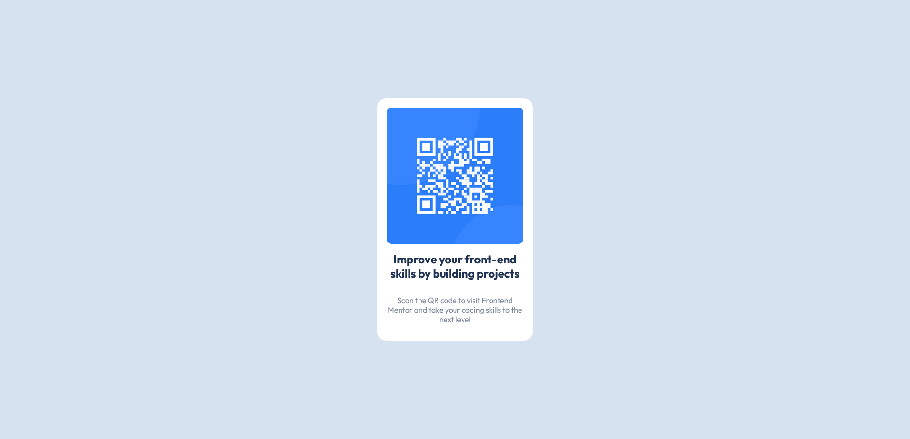

# Frontend Mentor - QR code component solution

This is a solution to the [QR code component challenge on Frontend Mentor](https://www.frontendmentor.io/challenges/qr-code-component-iux_sIO_H). Frontend Mentor challenges help you improve your coding skills by building realistic projects. 

## Table of contents

- [Overview](#overview)
  - [Screenshot](#screenshot)
  - [Links](#links)
- [My process](#my-process)
  - [Built with](#built-with)
  - [What I learned](#what-i-learned)
  - [Continued development](#continued-development)
- [Author](#author)

**Note: Delete this note and update the table of contents based on what sections you keep.**

## Overview

### Screenshot

### Links

- Solution URL: [GitHub Solution](https://github.com/Sengsith/qr-code-component)
- Live Site URL: [Netlify Deployed Site](https://sengsith-qr-component.netlify.app/)

## My process

### Built with

- Semantic HTML5 markup
- CSS custom properties
- Flexbox
- Mobile-first workflow

### What I learned

This time in general, I was proud of my speed in being able to complete this project. There wasn't anything too complicated in this project.

### Continued development

I definitely want to focus on mastering a responsive layout. While I believe that this project looks good for specific mobile and desktop sizes, resizing the window between sizes causes it to grow and shrink in ways I would not like it to.

## Author

- Frontend Mentor - [@Sengsith](https://www.frontendmentor.io/profile/Sengsith)